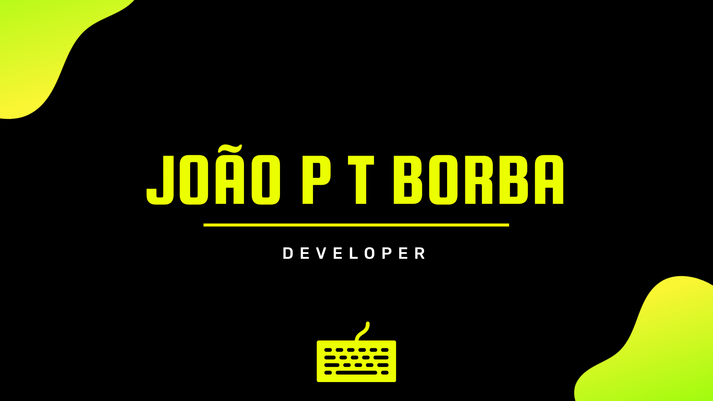

<!-- APRESENTAÇÃO GIF -->

<!-- APRESENTAÇÃO -->
<h1 align="right">Hi, nice to meet you
<!--
    
-->
<!---->
</h1>

Welcome to my GitHub!
     
    Software Engineer at Asaas. I work with a very good team. Where we prioritize code quality above all.
     
	<!--
    
    
    
	-->

   <!--spacing-3x-->

<!-- FOCO... -->
<!--
<h3 align="left">
    &nbsp;&nbsp;&nbsp;&nbsp;&nbsp;&nbsp;
    A Beginner Developer Focused On Web / Mobile
</h3>
-->

<!-- SOBRE MIM -->
 

- 📚 Senai and UDESC

- 💻 I currently develop mainly in languages Java, Groovy, PHP, C, JavaScript, Typescript, NodeJS, HTML5, CSS 
- Hibernate, Spring, Angular, Jquery, Bootstrap, ReactJS and more.
- ☁️ Database managers: MySQL, SQL Server and Oracle.
- ⚖️ Unit tests with JUnit
- 📦 Package Management: Maven, Yarn and Node.
- ✔️ Scrum
- ✔️ microservices, Docker, Linux

- ✉ How to reach me **jptruchinski@gmail.com**

 <!--spacing-->

<!-- TECNOLOGIAS -->
<h3 align="right">
    My Development Stack
    &nbsp;
</h3>

 &nbsp;
    <!--<code></code>&nbsp;-->
    <code></code>&nbsp;
	<code></code>&nbsp;
	<code></code>&nbsp;
    <!--<code></code>&nbsp;-->
	<code></code>&nbsp;
	<code></code>&nbsp;
	<code></code>&nbsp;
	<code></code>&nbsp;
	<code></code>&nbsp;
	<code></code>&nbsp;
    <code></code>&nbsp;|  &nbsp;
	<code></code>&nbsp;
	<code></code>&nbsp;
    <code></code>&nbsp;
    |&nbsp;
    <code></code>&nbsp;
    <code></code>&nbsp;
    <code></code>&nbsp;

 <!--spacing-->

<!-- API | MYGITHUB -->

    
	 
    

<!-- #282a36 | fbfbfb
     #ff79c6 | 6651ab
     #ff441e | ff3108 -->

<!-- API | POINTS -->

    

---

<!-- REDES SOCIAIS -->

    
    
    

<!--
**jpdev01** is a ✨ _special_ ✨ repository because its `README.md` (this file) appears on your GitHub profile.

Here are some ideas to get you started:

- 🔭 I’m currently working on ...
- 🌱 I’m currently learning ...
- 👯 I’m looking to collaborate on ...
- 🤔 I’m looking for help with ...
- 💬 Ask me about ...
- 📫 How to reach me: ...
- 😄 Pronouns: ...
- ⚡ Fun fact: ...
-->
